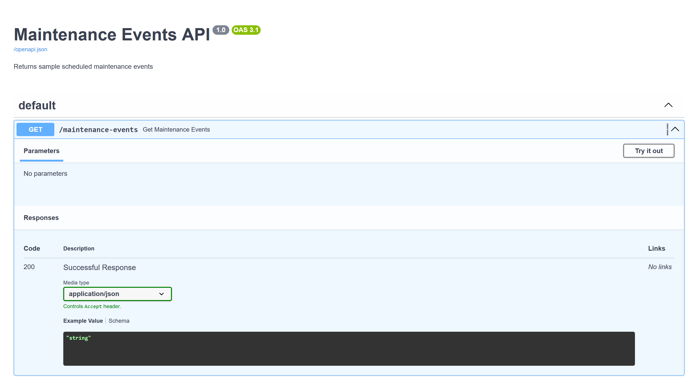
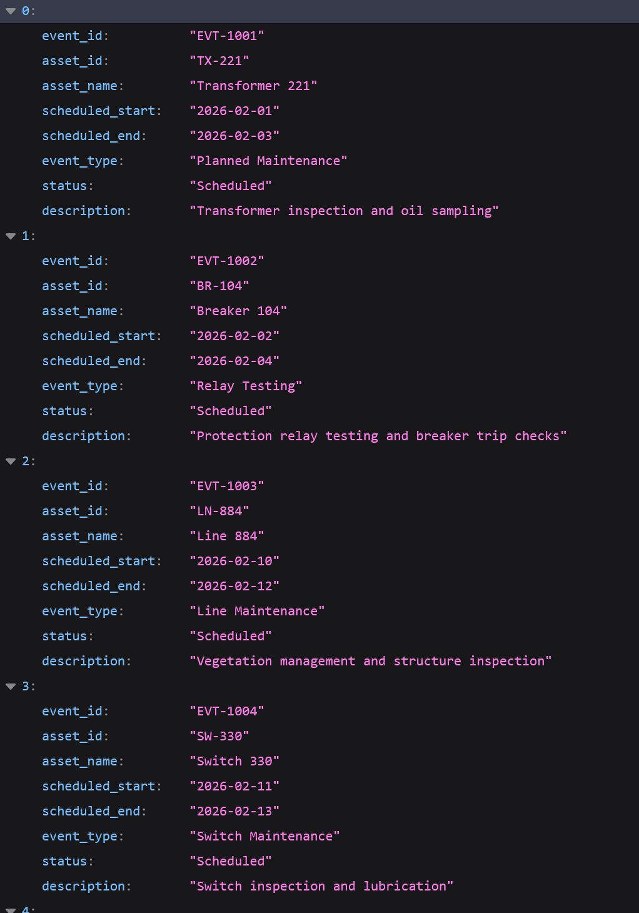
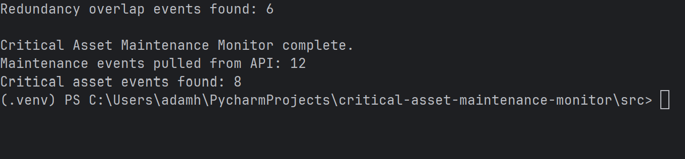
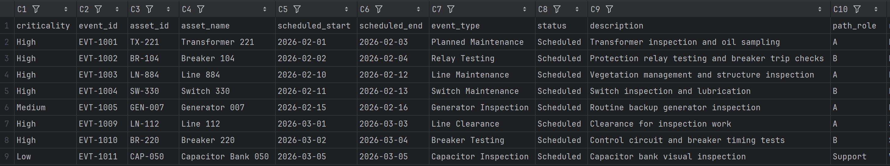
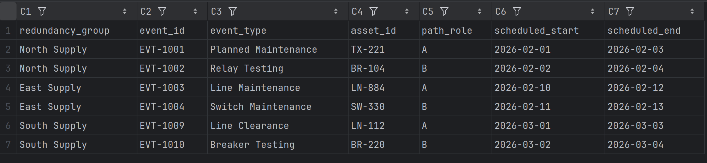

# Critical Asset Maintenance Monitor

A Python API-to-report automation demo that identifies scheduled maintenance events affecting critical assets and detects overlapping maintenance windows that may reduce operational redundancy.

This project demonstrates a practical operations automation pattern: pulling structured event data from an API, comparing it against a critical asset reference list, applying business rules, and generating clean exception reports for review.

The data in this project is fictional and sanitized, but the workflow is modeled after real operational monitoring and outage-review processes where accuracy, timing, and repeatable reporting matter.

---

## Overview

Operations teams often need to review scheduled maintenance, outage, or work activity against a list of important assets.

The manual process usually looks like this:

1. Pull scheduled event data from a system or API.
2. Compare the affected assets against an internal critical asset list.
3. Identify events involving high-priority or operationally important assets.
4. Check whether multiple redundant paths or assets are affected during overlapping time windows.
5. Generate a report for review.

This project automates that workflow.

---

## Business Problem

Scheduled work can create operational risk when it affects critical assets or when multiple related assets are taken out of service during overlapping time windows.

Manually reviewing event lists against critical asset references is repetitive and error-prone, especially when:

- Event data comes from an external API or system.
- Critical asset data is maintained separately.
- Events must be compared by date range.
- Redundancy groups or alternate paths need to be considered.
- Reviewers need a clean exception report rather than a raw data dump.

This tool reduces manual review by automatically identifying the scheduled events most likely to require attention.

---

## Solution

The tool performs the following workflow:

1. Starts with a mock FastAPI service that simulates an external maintenance event API.
2. Pulls scheduled maintenance event data from the API.
3. Loads a local critical asset reference file.
4. Filters events based on status.
5. Identifies scheduled events affecting critical assets.
6. Detects overlapping events within the same redundancy group.
7. Generates CSV reports for review.

The goal is not to replace human operational judgment. The goal is to reduce manual filtering and help reviewers focus on events that may require closer review.

---

## Features

- Mock FastAPI endpoint for scheduled maintenance events.
- API client that pulls JSON data and converts it into a pandas DataFrame.
- Critical asset matching using an internal CSV reference file.
- Event filtering by status.
- Redundancy group overlap detection.
- CSV report generation.
- Input validation for required columns.
- Modular project structure for easier maintenance and testing.

---

## Tech Stack

- Python
- FastAPI
- Uvicorn
- Requests
- pandas
- argparse
- pathlib

---

## Project Structure

```text
critical-asset-maintenance-monitor/
│
├── src/
│   ├── app.py
│   ├── mock_api.py
│   ├── api_client.py
│   ├── analyzer.py
│   ├── reporters.py
│   └── utils.py
│
├── data/
│   ├── sample_input/
│   │   ├── maintenance_events.json
│   │   ├── critical_assets.csv
│   │   └── event_status_reference.csv
│   │
│   └── sample_output/
│
├── docs/
│   └── screenshots/
│
├── README.md
├── requirements.txt
└── .gitignore
```
## How It Works
### 1. Mock API

The project includes a small FastAPI app that simulates an external maintenance event system.

The mock API exposes:
```text
GET /maintenance-events
```
This endpoint returns scheduled maintenance event data from a local JSON file.

In a real-world environment, this could be replaced with a vendor API, outage management system, maintenance platform, internal work management system, or ticketing system.

### 2. API Client

The API client sends a request to the maintenance event endpoint and converts the JSON response into a pandas DataFrame.

This separates data retrieval from the business logic so the analyzer does not need to know where the data came from.

### 3. Critical Asset Matching

The analyzer compares scheduled maintenance events against a critical asset reference file.

The critical asset file includes fields such as:
```text
asset_id
asset_name
criticality
redundancy_group
path_role
```
This allows the tool to identify which scheduled events affect important assets.

### 4. Redundancy Conflict Detection

The tool checks for overlapping maintenance windows within the same redundancy group.

A potential conflict is identified when:

- Two scheduled events affect assets in the same redundancy group.
- The events have overlapping start/end dates.
- The affected assets represent different path roles.

This helps flag situations where multiple related paths or assets may be affected during the same time period.

### 5. Report Generation

The tool generates CSV reports that can be reviewed by an operator, analyst, coordinator, or manager.

Recommended output files:

```text
critical_asset_events.csv
redundancy_conflicts.csv
Sample Input Data
Maintenance Events
```
The mock API returns event records with fields similar to:

```text
event_id
asset_id
asset_name
scheduled_start
scheduled_end
event_type
status
description
```

Example:

```json
{
  "event_id": "EVT-1001",
  "asset_id": "TX-221",
  "asset_name": "Transformer 221",
  "scheduled_start": "2026-02-01",
  "scheduled_end": "2026-02-03",
  "event_type": "Planned Maintenance",
  "status": "Scheduled",
  "description": "Transformer inspection and oil sampling"
}
```
## Critical Assets

The critical asset reference file contains records like:

```text
asset_id
asset_name
criticality
redundancy_group
path_role
notes
```
Example:

```csv
asset_id,asset_name,criticality,redundancy_group,path_role,notes
TX-221,Transformer 221,High,North Supply,A,Primary supply asset for North Supply group
BR-104,Breaker 104,High,North Supply,B,Alternate path breaker for North Supply group
```
## Output Reports
### Critical Asset Events Report

This report lists scheduled events that affect assets found in the critical asset reference file.

Example output columns:

```text
event_id
asset_id
asset_name
scheduled_start
scheduled_end
event_type
status
description
criticality
redundancy_group
path_role
Redundancy Conflicts Report
```

This report identifies events that overlap within the same redundancy group.

Example output columns may include:

```text
event_id
asset_id
asset_name
scheduled_start
scheduled_end
criticality
redundancy_group
path_role
```

A future enhancement could generate a more detailed pairwise conflict report showing exactly which events overlap with each other.

### Installation
1. Clone the repository
```bash
git clone https://github.com/your-username/critical-asset-maintenance-monitor.git
cd critical-asset-maintenance-monitor
```

2. Create a virtual environment
```bash
python -m venv venv
```
### On Windows:
```bash
venv\Scripts\activate
```
### On macOS/Linux:
```bash
source venv/bin/activate
```
3. Install dependencies

```bash
pip install -r requirements.txt
```

### Usage

This project runs in two steps.

Step 1: Start the mock API

In the first terminal:

```bash
uvicorn src.mock_api:app --reload
```

The API will be available at:

```text
http://127.0.0.1:8000
```

You can view the FastAPI documentation at:
```text
http://127.0.0.1:8000/docs
```
Step 2: Run the report generator

In a second terminal:

```bash
python src/app.py \
  --endpoint maintenance-events \
  --assets data/sample_input/critical_assets.csv \
  --output-path data/sample_output \
  --critical \
  --overlaps
  ```

This generates both the critical asset event report and the redundancy overlap report.

### Example Terminal Output

```text
Critical Asset Maintenance Monitor complete.

Maintenance events pulled from API: 12
Critical asset events found: 7
Redundancy overlap events found: 6

Reports generated:
- data/sample_output/critical_asset_events.csv
- data/sample_output/redundancy_conflicts.csv
```

Your exact output may vary depending on the sample data and selected report options.

Example Commands

Generate only the critical asset event report:

```bash
python src/app.py \
  --endpoint maintenance-events \
  --assets data/sample_input/critical_assets.csv \
  --output-path data/sample_output \
  --critical
  ```

Generate only the overlap report:

```bash
python src/app.py \
  --endpoint maintenance-events \
  --assets data/sample_input/critical_assets.csv \
  --output-path data/sample_output \
  --overlaps
  ```

Generate both reports:

```bash
python src/app.py \
  --endpoint maintenance-events \
  --assets data/sample_input/critical_assets.csv \
  --output-path data/sample_output \
  --critical \
  --overlaps
  ```
### Screenshots
#### Mock API Documentation


#### Maintenance Event API Response


#### Terminal Output


#### Critical Asset Events Report

#### Redundancy Conflicts Report

### Business Use Cases

This automation pattern can be adapted for:

- Maintenance outage review
- Critical asset monitoring
- Work schedule risk review
- Operational redundancy checks
- Vendor API reporting
- Utility operations planning
- Facilities maintenance coordination
- Manufacturing equipment review
- IT infrastructure change management
- Compliance and reliability review workflows
- What This Project Demonstrates

This project demonstrates my ability to:

- Build and consume a REST-style API.
- Convert JSON API responses into structured pandas DataFrames.
- Compare API data against internal reference data.
- Apply business rules to identify exceptions.
- Detect overlapping date ranges.
- Generate clean CSV reports.
- Structure a Python automation project into maintainable modules.
- Document a workflow for handoff and reuse.
- Portfolio Case Study
- Situation

A team needs to review scheduled maintenance events and identify work that may affect important assets or reduce operational redundancy.

### Task

The goal was to automate the review process by comparing scheduled event data against a critical asset reference list and identifying overlapping work windows within the same redundancy group.

### Action

I built a Python automation workflow that uses a mock FastAPI service to simulate an external event source, pulls event data through an API client, processes the data with pandas, compares events against critical asset references, detects overlapping maintenance windows, and generates CSV reports for review.

### Result

The project demonstrates how API data can be transformed into decision-support reports that reduce manual review effort and help users focus on events that may require closer operational attention.

### Future Improvements

Potential enhancements include:

Generate a pairwise redundancy conflict report showing exactly which events conflict.
- Add Excel output with highlighted high-criticality events.
- Add configurable event status filtering.
- Add configurable minimum criticality threshold.
- Add email delivery for generated reports.
- Add support for XML input to mirror outage-management systems.
- Add automated tests for overlap detection logic.
- Add scheduled execution.
- Add a simple FastAPI endpoint for report generation.
- Add a lightweight dashboard for viewing generated reports.